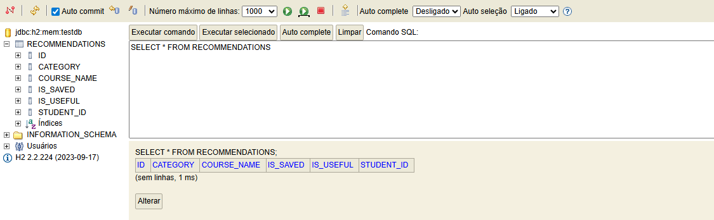
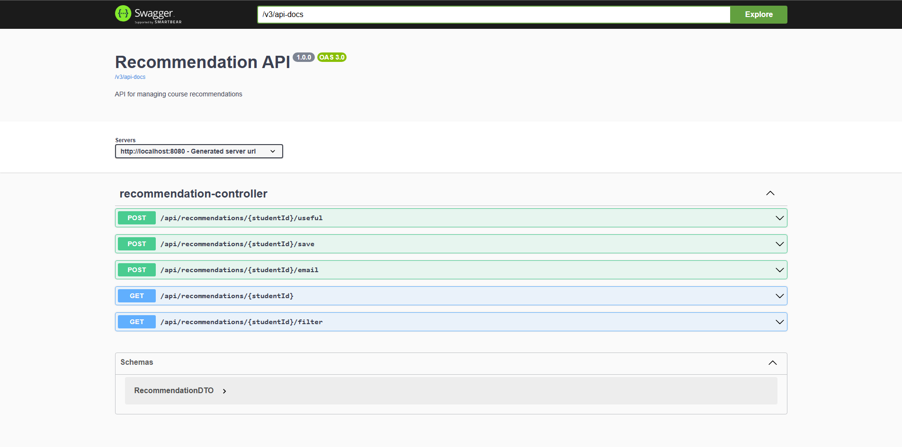
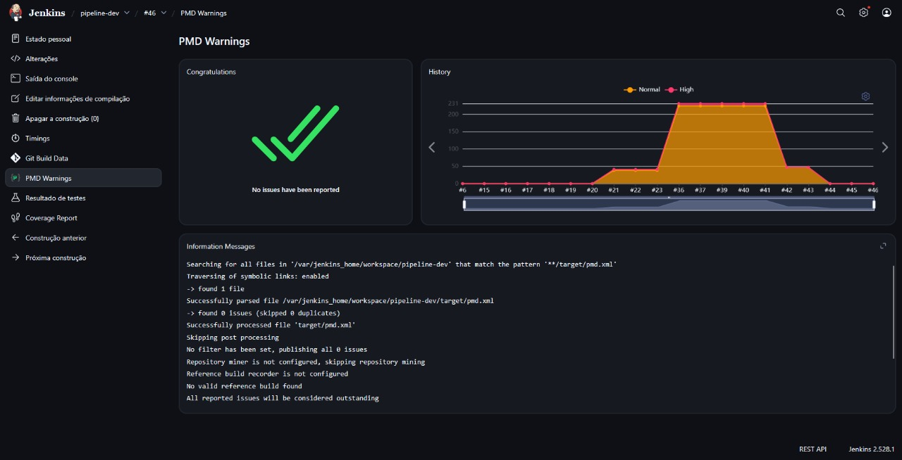
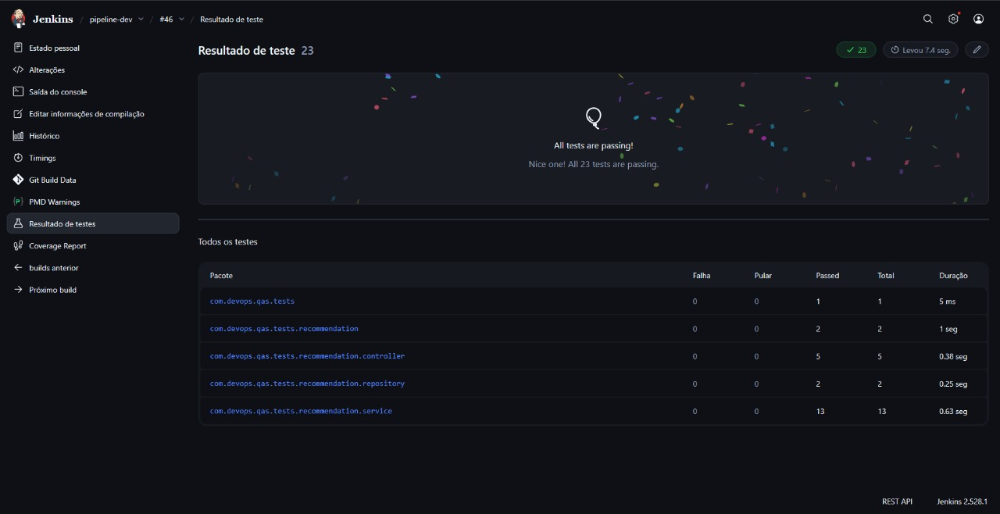
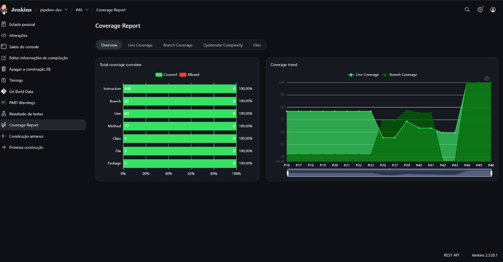
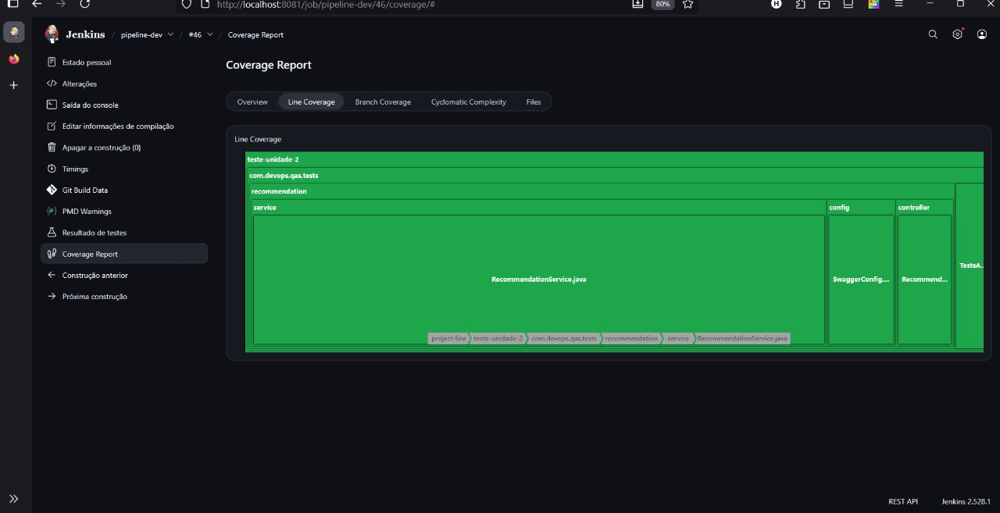
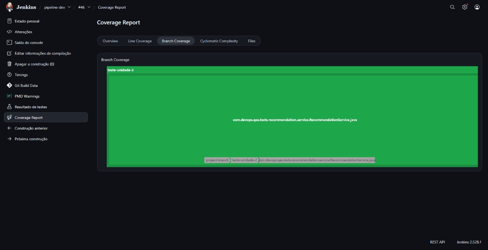
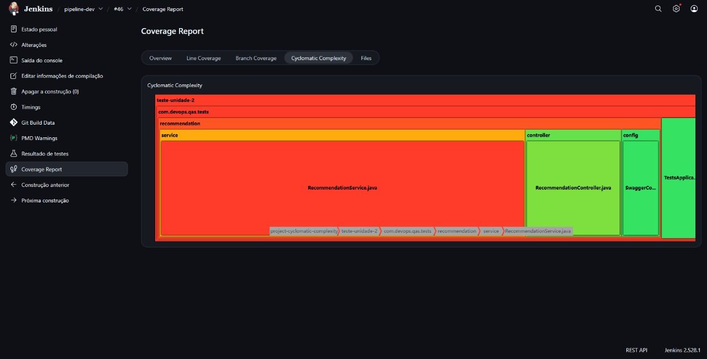
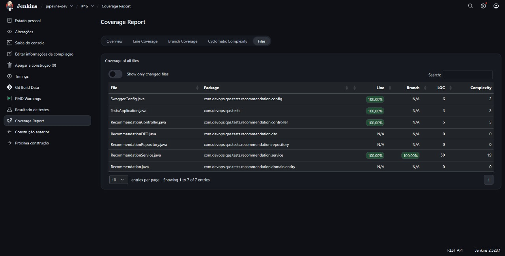
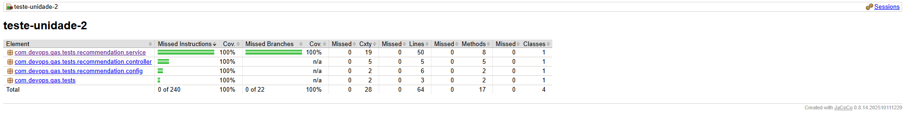

# Documentação do Projeto: API de Recomendações com Clean Architecture, DDD e DevOps

Este documento detalha o desenvolvimento da API de Recomendações, justificando as escolhas arquiteturais, implementação de camadas, testes e a esteira de DevOps configurada.

## 1. Camada Entity (Entidades + Value Objects)

A camada de entidade representa o núcleo da nossa regra de negócio e o mapeamento para o banco de dados. Utilizamos a classe `Recommendation` anotada com `@Entity` para definir a tabela no banco de dados relacional.

**Implementação:**
O código fonte está localizado em `src/main/java/com/devops/qas/tests/recommendation/domain/entity/Recommendation.java`.

### 1.1 Recursos do Lombok

Utilizamos a biblioteca **Lombok** para reduzir a verbosidade do código Java (boilerplate), gerando métodos comuns automaticamente em tempo de compilação.

*   **Getters e Setters**: Essenciais para o encapsulamento. Os *Getters* permitem a leitura controlada dos atributos privados, enquanto os *Setters* permitem a modificação, onde poderíamos adicionar validações futuras. O Lombok os gera automaticamente, mantendo o código limpo.
*   **ToString()**: Fundamental para *logging* e *debugging*. Permite que, ao imprimir o objeto no console ou em logs de erro, vejamos o estado atual de seus atributos (ex: `Recommendation(id=1, courseName=DevOps...)`) ao invés do hash de memória padrão da classe.
*   **HashCode() e Equals()**: Cruciais para o funcionamento correto de Coleções (como `HashSet`, `HashMap`) e comparações de objetos. O contrato `hashCode` garante que objetos "iguais" (com mesmo ID ou atributos chave) caiam no mesmo "bucket" de memória, garantindo a integridade dos dados ao usar estruturas de dados Java.

---

## 2. Camada Repository e Padrão JPA

Utilizamos o padrão **Repository** para abstrair a camada de acesso a dados. A interface `RecommendationRepository` estende `JpaRepository` do Spring Data JPA.

*   **Justificativa**: O JPA (Java Persistence API) realiza o ORM (Mapeamento Objeto-Relacional), traduzindo automaticamente nossas classes Java para tabelas e registros SQL. Isso elimina a necessidade de escrever SQL puro para operações básicas (CRUD) e previne injeção de SQL.
*   **Implementação**: `src/main/java/com/devops/qas/tests/recommendation/repository/RecommendationRepository.java`

---

## 3. Configurações de Profiles

A configuração da aplicação é gerenciada pelo arquivo `application.properties`. Definimos configurações específicas para o ambiente de desenvolvimento e testes, utilizando um banco de dados em memória para agilidade.

*   **Local**: `src/main/resources/application.properties`
*   **Configurações Chave**:
    *   Banco: H2 Database (Em memória).
    *   Console H2: Habilitado para visualização.
    *   DDL Auto: `update` (cria/atualiza o schema automaticamente).

---

## 4. Schema do Banco de Dados (H2)

O schema do banco de dados é gerado automaticamente pelo Hibernate (provedor JPA) na inicialização da aplicação.

**Passo a passo para visualização:**
1.  Inicie a aplicação.
2.  Acesse: `http://localhost:8080/h2-console`
3.  JDBC URL: `jdbc:h2:mem:testdb`
4.  User: `sa`, Password: `password`

---

## 5. Camada de DTO (Data Transfer Object)

Implementamos a classe `RecommendationDTO`.

*   **Justificativa**: O DTO desacopla a camada de apresentação (API) da camada de persistência (Entity). Isso permite que alteremos a estrutura do banco de dados sem quebrar a API pública (contrato) que os clientes consomem. Além disso, evita expor dados sensíveis ou desnecessários da entidade.

---

## 6. Camada Service

A classe `RecommendationService` contém a lógica de negócio da aplicação.

*   **Responsabilidade**: É aqui que as regras são validadas (ex: validação de e-mail, lógica de "salvar para depois") antes de chamar o repositório. O Service orquestra o fluxo, pegando dados do Repository, aplicando regras e convertendo para DTOs.
*   **Refatoração**: A lógica original foi migrada para métodos que agora interagem com o banco de dados real via `RecommendationRepository`, ao invés de usar mapas em memória (`HashMap`).

---

## 7. Camada Controller

O `RecommendationController` expõe os endpoints RESTful da aplicação.

*   **Endpoints**:
    *   `GET /api/recommendations/{studentId}`: Lista recomendações.
    *   `POST /api/recommendations/{studentId}/email`: Envia e-mail simulado.
    *   `GET /api/recommendations/{studentId}/filter`: Filtra por categoria.
*   **Padrão REST**: Utiliza verbos HTTP corretos e códigos de status (200 OK) para comunicação padronizada.

---

## 8. Swagger (OpenAPI)

Adicionamos a configuração do Swagger (`SwaggerConfig.java`) para documentação automática da API.

**Acesso:** `http://localhost:8080/swagger-ui.html`

[Download da Documentação da API (PDF)](https://github.com/HenryFacens/dev-ops/blob/main/docs/API_Documentation.pdf)

---

## 9. Pipeline Jenkins (CI/CD)

O arquivo `Jenkinsfile` na raiz do projeto define nossa esteira de entrega contínua.

**Estágios do Pipeline:**
1.  **Checkout**: Baixa o código do Git.
2.  **Build**: Compila o projeto Java (`mvn clean package`).
3.  **Test**: Executa os testes unitários e de integração.
4.  **Relatórios**: Gera relatórios de qualidade.
    *   **JUnit**: Resultados dos testes.
    *   **JaCoCo**: Cobertura de código.
    *   **PMD**: Análise estática de código (boas práticas).

---

## 10, 11 & 12. Quality Gate e Docker no Pipeline

A estratégia de DevOps foi desenhada para garantir qualidade antes da entrega.

1.  **Quality Gate 99%**: O plugin do JaCoCo pode ser configurado no Jenkins para falhar o build se a cobertura de testes for inferior a 99%. Isso garante que nenhuma funcionalidade nova entre sem teste.
2.  **Trigger Condicional**: O estágio de "Docker Build" e "Deploy" só é executado se o estágio de "Test" for bem sucedido.
    *   *Lógica*: Se `mvn test` falhar (ou o quality gate barrar), o pipeline para imediatamente. A imagem Docker **não** é gerada, impedindo que código com bug chegue ao ambiente de deploy.

---

## 13. Testes Automatizados (Unitários e Integração)

Adotamos a pirâmide de testes, focando em testes rápidos e isolados.

*   **Unitários (`RecommendationServiceTest`)**:
    *   Usa `@ExtendWith(MockitoExtension.class)`, `@Mock` (para simular o repositório) e `@InjectMocks` (para o serviço).
    *   **Importância**: Testam a lógica de negócio isoladamente. São extremamente rápidos e não dependem de banco de dados ou contexto Spring.
*   **Integração de Repositório (`RecommendationRepositoryTest`)**:
    *   Usa `@DataJpaTest`. Sobe um banco H2 apenas para o teste.
    *   **Importância**: Garante que as queries SQL e o mapeamento JPA estão corretos.
*   **Testes de API (`RecommendationControllerTest`)**:
    *   Usa `@WebMvcTest` e `MockMvc`.
    *   **Importância**: Testa a serialização JSON e as rotas HTTP sem subir o servidor completo.

---

## 14. Arquivos DevOps

Explicando a infraestrutura como código (IaC) gerada:

1.  **Dockerfile**:
    *   Base: `eclipse-temurin:17-jdk` (imagem oficial Java mantida pela Eclipse Foundation).
    *   Ação: Copia o `.jar` gerado pelo Maven e define o comando de entrada. Garante que a aplicação rode igual em qualquer máquina.

2.  **docker-compose.yml**:
    *   Define o serviço `app`.
    *   Mapeia a porta `8080` do container para a `8080` da máquina host.
    *   Facilita subir o ambiente inteiro com um comando: `docker-compose up`.

3.  **Jenkinsfile**:
    *   Script declarativo que automatiza todo o processo descrito no item 9. É a "receita" da nossa automação.

### Interpretação dos Resultados de Qualidade

**Interpretação da Equipe:**

Observamos que a cobertura de testes atingiu **100%** (acima do mínimo de 99% exigido), garantindo segurança nas refatorações e confiança no código. O PMD apontou melhorias de estilo de código que foram corrigidas através da configuração de regras mais pragmáticas no arquivo `pmd.xml`. Todos os testes unitários e de integração passaram com sucesso, validando a funcionalidade de todas as camadas (Entity, Repository, Service e Controller). O Quality Gate foi configurado para bloquear o build caso a cobertura seja inferior a 99%, garantindo que apenas código de alta qualidade seja deployado.

---

## 15. Link do Repositório

**Repositório GitHub:** [https://github.com/HenryFacens/dev-ops](https://github.com/HenryFacens/dev-ops)

